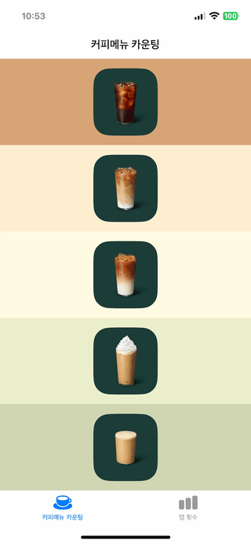

t

> Elly 구현 내용

- 기능
    - 탭바 구성 (커피메뉴 카운팅 / 탭 횟수)
    - 커피메뉴 카운팅 탭
        - 각 메뉴를 누를 때마다 카운팅이 1씩 올라감
        - 커피 메뉴 종류
            - 아메리카노
            - 카페 라떼
            - 카라멜 마끼아토
            - 바닐라 라떼
            - 헤이즐넛 라떼
        - 딥 프레싱을 하면 컨텍스트 메뉴가 나옴
            - 컨텍스트 메뉴 내용
                - 모두 초기화
                - +1
                - +5
                - +10
    - 탭 횟수 탭
        - 커피메뉴 카운팅에서 누른 횟수를 정리해 보여줌
        - 네비게이션 바 오른쪽에 설정 아이콘
            - 아이콘 누르면 컨텍스트 메뉴 뜸
            - 컨텍스트 메뉴 내용
                - 모두 초기화
                - 아메리카노 초기화
                - 카페 라떼 초기화
                - 카라멜 마끼아또 초기화
                - 바닐라 라떼 초기화
                - 헤이즐넛 라떼 초기화
    - 기타
        - 커피메뉴 카운팅의 경우 메뉴가 이미지로 구성
        - 커피메뉴 누를 때 색상 변경 및 현재 카운팅 숫자 나타남 -> 1초 후 사라짐
        - 타이틀 : 각 탭 바 타이틀
        
- 구현 미리보기

 
